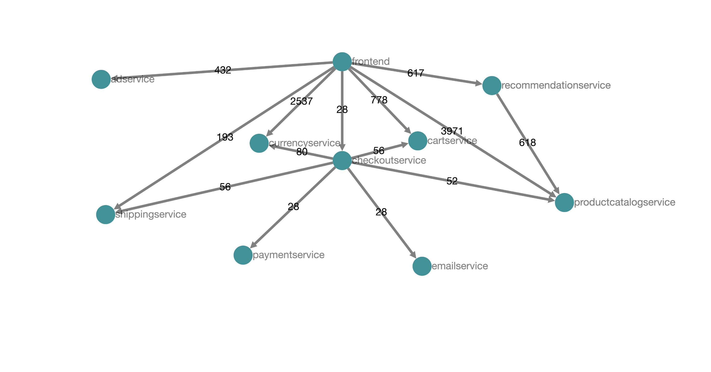

# Test Application 

This test uses [OpenTelemetry Microservices Demo](https://github.com/pavankrish123/opentelemetry-microservices-demo/tree/demo) and collector farm 

## Deployment 

`[OpenTelemetry MicroServices Demo Services] -> [Collector Farm]`

## Instructions 

### Install the Collector Farm (Assuming pre-requisite of OpenTelemetry Operator installation) 

```bash 
 kubectl apply -f collector-farm.yaml
```

### Run the Microservices Demo application 

- Checkout [OpenTelemetry Microservices Demo](https://github.com/pavankrish123/opentelemetry-microservices-demo/tree/demo) 
- `skaffold run`

### The farm is configured to push traces to Jaeger and Metrics to Prometheus


